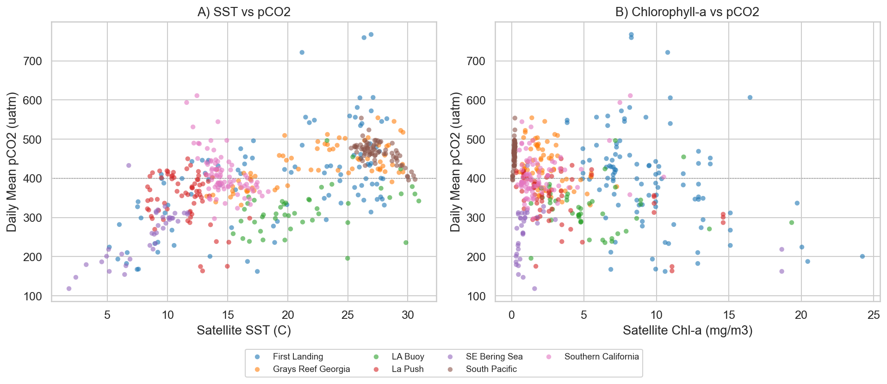

# Data Exploration & Training Dataset Report

**Project:** Predicting ocean pCO2 from satellite remote sensing  
**Team:** GeOceanographers  
**Date:** March 2, 2026

---

## 1. Objective

Build a machine learning training dataset that pairs **in-situ ocean pCO2 measurements** from NOAA buoys with **satellite-derived sea surface temperature (SST)** and **chlorophyll-a (chl-a)** observations.  The goal is to train a model that predicts surface ocean pCO2 using only remotely sensed inputs — enabling pCO2 estimation at locations and times where no buoy exists.

---

## 2. Buoy Data

We use quality-controlled measurements from **7 NOAA OCADS buoy sites** spanning the U.S. coastline and open ocean (2013–2025). Each site records pCO2 and SST at sub-hourly intervals (~3 min cadence).

| Site | Region |
|---|---|
| First Landing | Chesapeake Bay, Virginia |
| Grays Reef Georgia | South Atlantic Bight |
| LA Buoy | Louisiana coast / Gulf of Mexico |
| La Push | Washington coast / NE Pacific |
| SE Bering Sea | Bering Sea, Alaska |
| South Pacific | Open South Pacific |
| Southern California | Southern California Bight |

**Processing steps:**

1. Parsed timestamps, cleaned coordinates, converted pCO2 and SST to numeric values
2. Aggregated sub-hourly observations to **daily means** per site
3. Applied quality filter: kept only days with **≥ 4 pCO2 observations**
4. Result: **8,487 quality-controlled buoy-days** across 7 sites

---

## 3. Satellite Data Sources

### MUR SST (Sea Surface Temperature)

- **Dataset:** JPL MUR SST v4.1 (`jplMURSST41`)
- **Source:** NOAA CoastWatch ERDDAP
- **Resolution:** ~1 km, daily
- **Method:** For each buoy-day, queried a 12 km × 12 km bounding box centered on the buoy location. This returns ~150–180 SST pixels per query.

### MODIS Aqua Chlorophyll-a

- **Dataset:** MODIS Aqua 8-day composite (`erdMH1chla8day`)
- **Source:** NOAA CoastWatch ERDDAP
- **Resolution:** ~4 km, 8-day composites
- **Method:** Queried a ±8 day window around the buoy date, selected the composite closest in time. Returns ~12–16 chl-a pixels per query. Cloud cover causes gaps (~33% of buoy-days have no chl-a).

---

## 4. Training Dataset Construction

We sampled **100 buoy-days per site** (700 total) and fetched satellite SST + chl-a for each. Each pixel grid was summarized into **per-buoy-day statistics**:

| Feature | Description |
|---|---|
| `sat_sst_mean` | Mean SST across all pixels in the 12 km box |
| `sat_sst_std` | Standard deviation of SST pixels (spatial variability) |
| `sat_sst_min / max` | SST range in the box |
| `sat_sst_median` | Median SST pixel value |
| `sat_sst_closest` | SST of the pixel nearest to the buoy |
| `sat_chla_mean` | Mean chlorophyll-a across pixels |
| `sat_chla_std / min / max / median / closest` | Same summary stats for chl-a |
| `chla_days_offset` | Days between buoy date and nearest chl-a composite |
| `sst_in_situ_mean` | Buoy-measured SST (for validation) |
| `pco2_mean` | **Target variable** — daily mean pCO2 from buoy |

### Coverage

| | Count | % of 700 |
|---|---|---|
| With satellite SST | ~690 | ~99% |
| With satellite chl-a | ~480 | ~69% |
| **With both (ML-ready)** | **479** | **68%** |

---

## 5. Visualizations

### 5.1 Training Samples per Site

Not all sites contribute equally — First Landing has the best satellite coverage (100/100), while SE Bering Sea has the most cloud-related chl-a gaps (36/100).

### 5.2 Satellite SST vs In-Situ SST (Validation)

This is a critical sanity check: if the satellite SST matches the buoy SST, we know the ERDDAP queries are returning data from the correct locations and times.

**Result: r = 0.998, RMSE = 0.50°C** — the satellite data is an excellent match to the buoy measurements. The tight clustering along the 1:1 line confirms our spatial matching approach works.

### 5.3 pCO2 Distribution by Site

The target variable (pCO2) spans a wide range (~120–770 µatm) and varies substantially by site. The red dashed line marks atmospheric CO2 (~400 µatm) — values above this line indicate the ocean is a CO2 **source**, below it a CO2 **sink**.

Key observations:
- **SE Bering Sea** is consistently undersaturated (strong carbon sink)
- **First Landing** has the widest range, including very high values (coastal estuary dynamics)
- **South Pacific** and **Grays Reef** are slightly above atmospheric equilibrium

### 5.4 Satellite Features vs pCO2

These scatter plots show the two main predictor-target relationships the ML model will learn:

**Panel A (SST vs pCO2):** There is no simple linear relationship — the pattern varies by site. Warm tropical sites (South Pacific, ~25–30°C) cluster near 400–500 µatm, while cold-water sites (SE Bering Sea, La Push) span a wider pCO2 range at lower temperatures. This non-linearity is why we need ML rather than a simple regression.

**Panel B (Chl-a vs pCO2):** High chlorophyll (phytoplankton blooms) tends to be associated with lower pCO2 — photosynthesis draws down CO2. But the relationship is noisy and site-dependent, reinforcing the need for a multi-feature model.

---

## 6. Summary & Next Steps

**What we have:**
- A clean, 479-row training dataset with 15 features per buoy-day
- Satellite SST and chl-a matched to in-situ pCO2 across 7 ocean sites
- Validated satellite SST against buoy measurements (r = 0.998)

**Output files** (in `data/processed/`):
- `training_data_700.csv` — all 700 sampled buoy-days (some missing satellite data)
- `training_data_700_ml_ready.csv` — 479 rows with both SST + chl-a present

**Next steps:**
1. Train baseline ML models (Random Forest, Gradient Boosting) to predict pCO2
2. Evaluate with train/test split, report RMSE and R²
3. Analyze feature importance to understand which satellite features matter most
4. Consider adding temporal features (month, season) to capture seasonality
