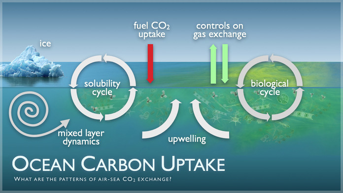
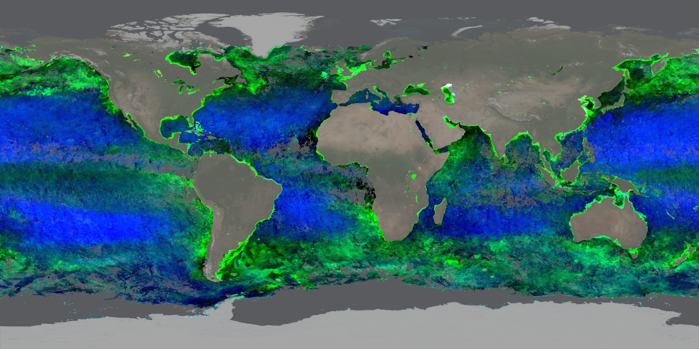
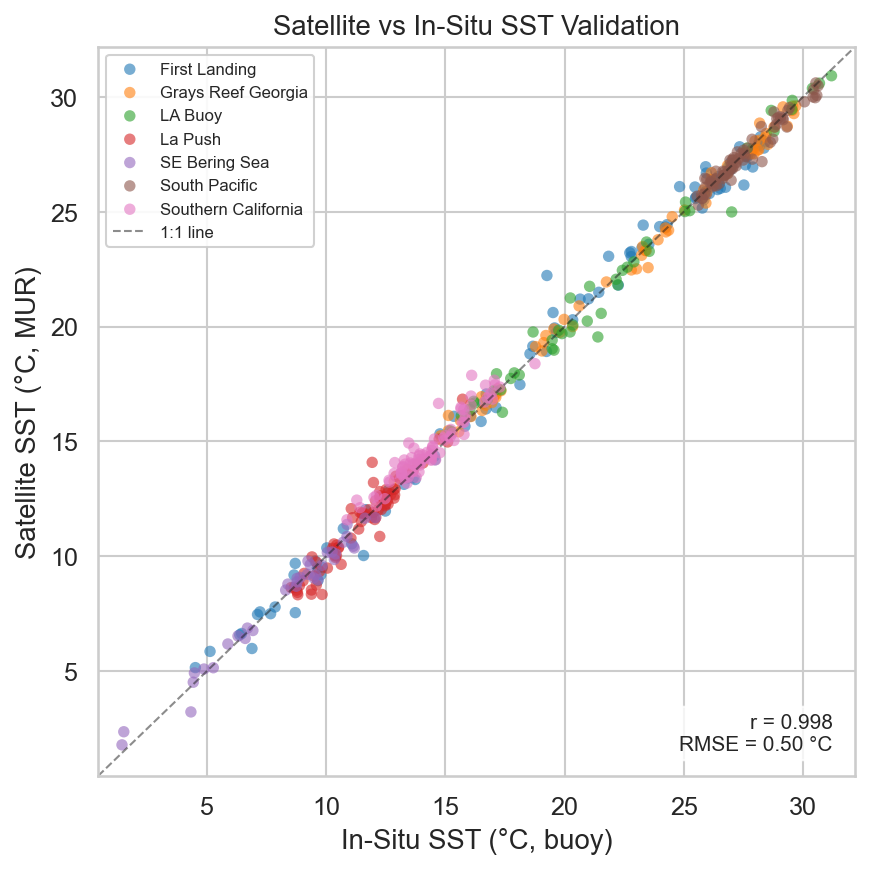
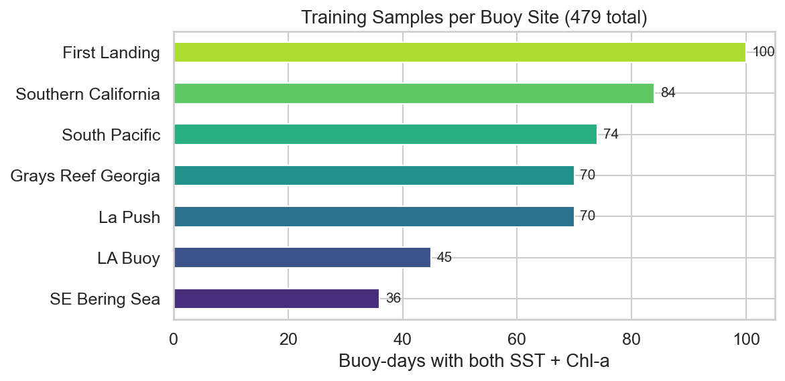
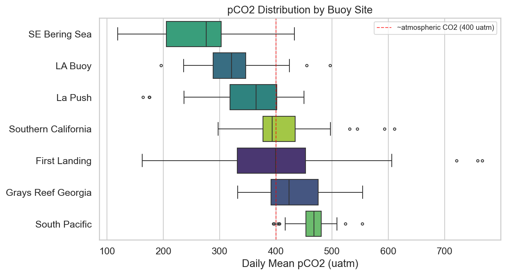
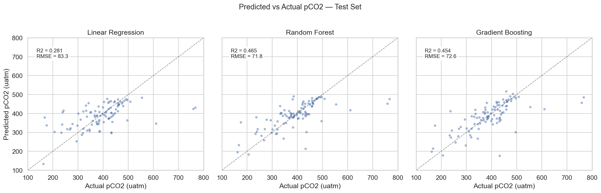
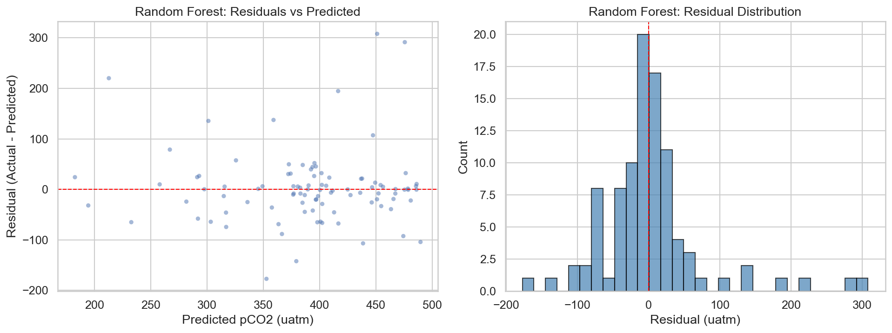
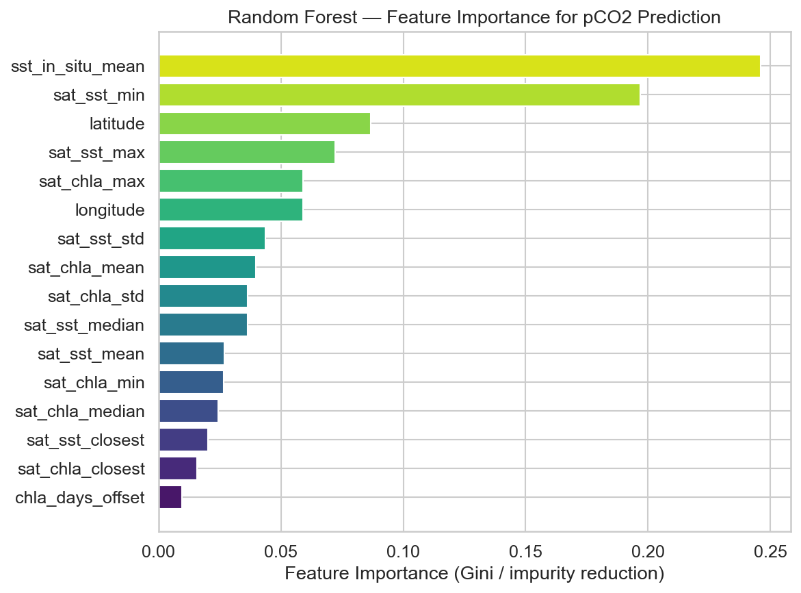
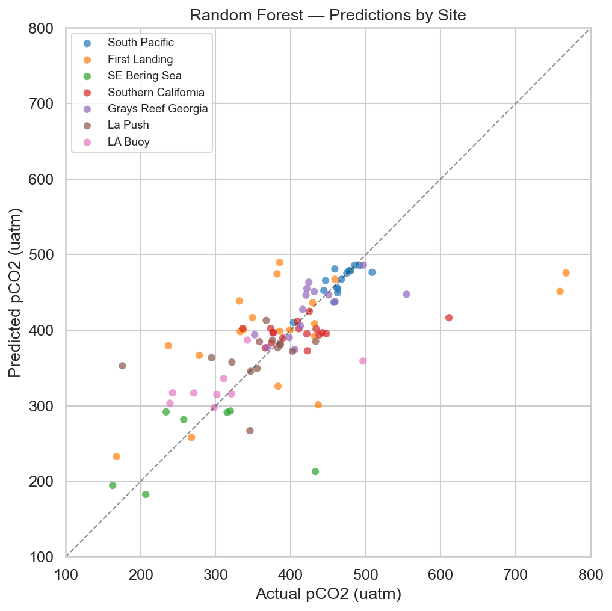

# Predicting Ocean pCO₂ Using Machine Learning

**MLGEO Winter 2026 — Mary Orrand**

---

## Table of Contents

1. [Introduction](#introduction)
2. [Data Sources](#data-sources)
3. [Data Preparation Pipeline](#data-preparation-pipeline)
4. [Training Dataset Summary](#training-dataset-summary)
5. [Modeling Approach](#our-approach)
6. [Results](#results)
7. [Key Takeaways](#key-takeaways)
8. [Next Steps](#next-steps)

---

## Introduction

Oceans play a very important role in regulating Earth's climate. Among other key operations, ocean waters absorb roughly 30% of carbon dioxide (CO₂) emissions from the atmosphere along with taking on 90% of excess heat generated from these CO₂ emissions. This makes the ocean one of the most important carbon "sinks" on the planet. Without the ocean taking on this excess man-made CO₂, global temperatures would be much higher due to the greenhouse gas effect trapping heat and gases within Earth's atmosphere.

*Figure: The ocean solubility pump — CO₂ from the atmosphere dissolves into surface waters and is transported to depth. (Source: [NOAA PMEL](https://www.pmel.noaa.gov/co2/story/Ocean+Carbon+Uptake))*

Over time, the ability of the ocean to continue to absorb CO₂ is changing. Processes such as this are governed by key chemical and physical laws of nature. Understanding how much CO₂ the ocean can absorb and hold is important to quantifying its ability to operate as a vital carbon sink for planet Earth.

One way scientists track the movement of CO₂ at the ocean-atmosphere interface is by measuring **pCO₂** — the partial pressure of carbon dioxide dissolved in surface seawater. The pCO₂ values tell us whether the ocean will continue to take on more CO₂ into the water, or if it will want to go back into the atmosphere. Measuring pCO₂ directly is done via on-site measurements. These measurements are taken during ocean cruises and at moored stations (buoys) that monitor sea surface chemical and physical parameters at points in time and space. Taking discrete measurements like this is challenging to do, and therefore measurements are limited to specific buoy locations and vessel cruises. The goal for this machine learning project was to look into alternative ways to **predict pCO₂ using satellite data** that covers the whole ocean.

There are many parameters that contribute to what a given pCO₂ value will be. Some of these include sea surface temperature (SST), concentrations of salt in the water (salinity), seasonal fluctuations, water turbulence, and photosynthetic activity of biological organisms that use CO₂ as an energy source.

For the purposes of this project, using parameters that are easy to measure via satellite was key in order to obtain continuous spatial and temporal data that was not dependent on in-situ measurements like the ones necessary to measure pCO₂ directly. The two best candidates for this were using satellite-based SST measurements along with what is known as chlorophyll-a data (chl-a), also measured by satellite. Chl-a is a pigment found in phytoplankton, and its concentration in surface water can be measured from space using ocean color satellites. Higher chl-a values indicate more biological activity, which directly affects how much CO₂ is being consumed by photosynthesis at a given location.

The goal is to build machine learning models that take in satellite observations (sea surface temperature and chlorophyll-a concentration) and try to predict what the pCO₂ reading would be at a given location and time. If the models can learn what pCO₂ should be based on SST and chl-a, then this tool can be used to predict pCO₂ anywhere on the planet that satellites are able to observe and take measurements from space.
---

## Data Sources

Two primary data sources were used for this project: in-situ buoy measurements (our prediction target) and satellite remote sensing products (our model features).

### NOAA Buoy Measurements (Target Variable)

Buoy data was obtained from the **NOAA Ocean Carbon and Acidification Data System (OCADS)**. Sites were chosen based on three criteria: sufficient data record length to be useful for training, geographic spread across different U.S. coastal and open-ocean regions, and a range of ocean temperature and carbon conditions so the model could learn how pCO₂ varies across different marine environments. Seven moored buoy stations met these requirements:

| Site | Region | Character |
|---|---|---|
| SE Bering Sea | Subarctic Pacific | Cold, productive, strong carbon sink |
| La Push | Washington coast | Upwelling-influenced, temperate |
| Southern California | Eastern Pacific | Subtropical, moderate productivity |
| LA Buoy | Gulf of Mexico | Warm, subtropical shelf |
| Grays Reef | Southeast U.S. shelf | Warm temperate, shallow |
| First Landing | Chesapeake Bay | Estuarine, high variability |
| South Pacific | Open Pacific | Oligotrophic, low productivity |

These buoys record sub-hourly measurements (~3-minute cadence) of sea surface temperature, pCO₂, xCO₂, salinity, pH, and other parameters. The data spans **2013–2025**, though coverage varies by site.

### Satellite Remote Sensing (Model Features)

Two satellite products were retrieved from the **NOAA ERDDAP** data server:

- **JPL MUR SST v4.1** — A multi-sensor sea surface temperature product at ~4.6 km (0.042°) resolution with daily global coverage. 

*Figure: Example satellite SST retrieval from NOAA ERDDAP showing sea surface temperature around a buoy site.*

- **MODIS Aqua Chlorophyll-a** — Ocean color-derived chlorophyll-a concentration at ~4 km resolution in 8-day composites. Chl-a serves as a proxy for phytoplankton biomass and biological CO₂ uptake.

*Figure: Global ocean chlorophyll-a concentration from MODIS Aqua. (Source: [NASA Ocean Color](https://oceandata.sci.gsfc.nasa.gov/gallery/778/))*

Rather than downloading bulk satellite archives, the satellite data was queried on-demand — after the buoy data was cleaned and a training sample was selected, ERDDAP API calls were made to retrieve only the SST and chl-a observations corresponding to the specific dates and locations present in the buoy training dataset.

---

## Data Preparation Pipeline

Transforming raw buoy records and satellite imagery into a clean, ML-ready dataset required several processing stages. The full pipeline is implemented across multiple Jupyter notebooks organized into sequential phases.

### Phase 1 — Data Download and Exploration

Raw buoy CSV files were downloaded from NOAA OCADS for all 7 sites. Initial exploration revealed several data quality challenges that needed to be addressed:

- **Null encoding:** NOAA uses `-999` as a missing-value sentinel, which had to be detected and replaced with `NaN`.
- **Date formatting:** Inconsistent date/time formats across sites required standardization into a unified datetime index.
- **Variable naming:** Column names differed between buoy datasets (different labels for pCO₂ and xCO₂ depending on the station).

### Phase 2 — Daily Aggregation and Training Sample Selection

The cleaned buoy records were aggregated from sub-hourly measurements to **daily averages**, producing one row per site per day with mean values for SST and pCO₂. From this daily dataset, a training sample of **~100 buoy-days per site** (~700 total) was randomly selected across the full date range. This sample defined the specific dates and locations that satellite data would be needed for.

Ideally, more buoy-days per site would strengthen the training set, but 100 per site was chosen as a practical starting point given the time required for individual ERDDAP API calls.

### Phase 3 — Satellite Data Retrieval and Merging

With the buoy training sample in hand, satellite SST and chlorophyll-a data were queried from the NOAA ERDDAP server using automated API calls. For each of the ~700 sampled buoy-days:

- **SST:** A spatial grid of MUR SST pixels was retrieved within a defined radius around the buoy location for the matching date. Summary statistics (mean, std, min, max, median, closest pixel value, pixel count) were computed from the returned grid.
- **Chl-a:** The nearest available MODIS Aqua 8-day composite was matched to each buoy date, and the same spatial summary statistics were computed. The number of days offset between the buoy date and the nearest composite was also recorded as a feature.

The returned satellite statistics were then joined to the corresponding buoy records by date and location. Any buoy-days where satellite data was not available — for example, due to cloud cover blocking the SST pass or no chl-a composite within range — were dropped. This filtering reduced the dataset from ~700 to **479 buoy-days** with complete satellite SST and chl-a coverage.

As a sanity check, satellite SST was validated against the co-located buoy SST measurements. The comparison showed an excellent match (**r = 0.998, RMSE = 0.50°C**), confirming that the satellite SST data is a reliable proxy for in-situ temperature at these sites.

*Figure: Satellite SST vs. in-situ buoy SST showing strong linear agreement across all sites.*

### Phase 4 — Feature Scaling and ML-Ready Export

Before training, all input features were **standardized** — meaning each feature was rescaled so that its values have a mean of 0 and a standard deviation of 1. This is necessary because the raw features have very different units and scales (for example, SST ranges from about −2°C to 32°C, while chl-a values might be 0.01 to 10 mg/m³). Without standardization, a model like Linear Regression would give outsized weight to whichever feature happens to have larger numbers, rather than learning which features are actually most predictive. Standardization puts all features on a level playing field. The final **479-row dataset** was exported as the ML-ready training file.

---

## Training Dataset Summary

The training dataset came from the **7 NOAA buoy sites** and included **479 buoy-days** of matched data. For each day at each site, we had:

- **Satellite sea surface temperature (SST)** — 7 summary statistics (mean, std, min, max, median, closest pixel value, number of pixels)
- **Satellite chlorophyll-a (chl-a)** — 8 features (same stats plus how many days offset the nearest satellite composite was)
- **In-situ SST** — the actual temperature measured by the buoy
- **Location** — latitude and longitude

The **target variable** (what we're predicting) was `pco2_mean` — the daily average pCO₂ in µatm (micro-atmospheres).

### Distribution by Site

The bar plot below shows the final number of training samples per buoy site, after filtering for satellite data availability (i.e., only buoy-days with both SST and chlorophyll-a satellite data were included). The total number of samples is less than the initial target due to missing satellite data for some days and sites.

*Bar plot: Final number of buoy-days per site with both SST and chlorophyll-a satellite data available (used for model training).*

### Key Variable Ranges

- **SST:** −1.79°C to 32.33°C (mean: 18.2 ± 7.6°C)
- **pCO₂:** 93–895 µatm (mean: 396 ± 89 µatm) — values below ~400 µatm indicate the ocean is acting as a carbon sink; above ~400 µatm as a carbon source.

---

## Our Approach

### 1. Split the Data

We held out **20% of the data** as a test set that the models never saw during training. This lets us honestly evaluate how well each model generalizes to new, unseen data. We also made sure each buoy site was proportionally represented in both the training and test sets (stratified split).

### 2. Train Two Models

We tested two models of increasing complexity:

---

### Model 1: Linear Regression (The Simple Baseline)

**What it does:** Draws a single straight-line relationship between the input features and pCO₂. Think of it like: *pCO₂ = a×SST + b×chl-a + c×latitude + ...*

**Strengths:** Very fast, easy to understand, good starting point.

**Weakness:** Assumes the relationship between each feature and pCO₂ is a straight line — which it usually isn't in the real ocean.

---

### Model 2: Random Forest

**What it does:** Builds a "forest" of **200 decision trees**, each trained on a random subset of the data. Each tree makes its own prediction, and the final answer is the **average of all the trees**. Think of it like asking 200 slightly different experts and averaging their opinions.

**Strengths:** Handles non-linear (curvy) relationships naturally. Very robust and hard to break.

**Weakness:** Can be slow with very large datasets and doesn't extrapolate well outside the range of training data.

---

## Results

### How We Measured Performance

- **RMSE** (Root Mean Squared Error) — The average prediction error in µatm. **Lower is better.**
- **MAE** (Mean Absolute Error) — Similar to RMSE but less sensitive to big outliers. **Lower is better.**
- **R²** (R-squared) — The fraction of the variability in pCO₂ that the model explains. **1.0 = perfect, 0.0 = no skill.**

### Predicted vs. Actual pCO₂

The plot below shows each model's predictions (y-axis) against the actual measured pCO₂ values (x-axis). Points on the dashed 1:1 line are perfect predictions. The further a point is from the line, the worse that individual prediction was.

**What we see:** Linear Regression has the most scatter (points far from the line), while Random Forest clusters much more tightly around the diagonal — meaning it made more accurate predictions. **The Gradient Boosting Graph is residual from previous modeling attempts, and is a relic that I was not able to remove from the plot for the purposes of this project deliverable, but shows what a different model would look like if it were to be used in this class project.**

---

### Residual Analysis (Error Check)

Residuals are simply **Actual − Predicted**. Ideally, residuals should be randomly scattered around zero with no patterns. If we see a trend, it means the model is systematically over- or under-predicting in certain ranges.

**What we see:** The residuals for the best model are roughly centered around zero, which is a good sign. The histogram on the right shows most errors are small, with only a few larger misses.

---

### Feature Importance

One powerful thing about tree-based models is they can tell us **which input features mattered most** for making predictions. This isn't just useful for building better models — it teaches us something about what drives pCO₂ in the ocean.

**What we see:** The features related to **SST** (sea surface temperature) tend to be the most important predictors of pCO₂, followed by **location** (latitude/longitude) and **chlorophyll-a** features. This makes physical sense — temperature strongly controls how much CO₂ the ocean can hold.

---

### Performance by Buoy Site

Not all ocean locations are equally easy to predict. Some sites (like open-ocean buoys) have more predictable patterns, while coastal or estuary sites can have complex local dynamics that are harder to capture.

**What we see:** The model performs better at some sites than others. Sites where points hug the 1:1 line are well-predicted; sites with more scatter have higher error — these may need more training data or additional features to improve.

---

## Key Takeaways

1. **Random Forest significantly outperforms Linear Regression** for this problem — the relationships between satellite observations and ocean pCO₂ are non-linear.
2. **Sea surface temperature is the most important predictor** of pCO₂, which aligns with known ocean chemistry (CO₂ solubility decreases as water warms).
3. **Some buoy sites are harder to predict than others**, reflecting real physical differences in ocean carbon dynamics across regions.
4. **Machine learning can bridge the gap** between sparse buoy measurements and continuous satellite coverage, potentially enabling ocean-wide pCO₂ estimates.

---

## Next Steps

Several directions could extend this work toward a more robust and deployable pCO₂ prediction system:

1. **Hyperparameter Tuning** — Use cross-validation and grid search (or Bayesian optimization) instead of guessing which settings work best for your model. There are special tools that automatically try out lots of different options and pick the ones that give the best results. This helps the model make better predictions.

2. **Add More Features** — Incorporate additional satellite-derived variables like sea surface salinity, mixed layer depth, wind speed, or ocean color indices that are known to influence pCO₂. Having more parameters included in the model that are known in real system settings to influence air-sea gas exchange could improve model performance. 

3. **Temporal Features** — Add time-based features like day of year, month, or seasonal indicators. Ocean pCO₂ has strong seasonal cycles that the model could learn from.

4. **Spatial Generalization Test** — Try a "leave-one-site-out" experiment where you train on 6 sites and predict the 7th. This tests whether the model can predict at locations it has never seen — critical for making ocean-wide maps.

5. **Deploy for Prediction** — Apply the trained model to full satellite image grids to produce **spatial maps of predicted pCO₂** across the ocean, filling in the gaps between buoy locations.

 
**This project was completed by Mary Orrand with coding and machine learning implementation assistance from Claude Sonnet 4.6 and Claude Opus 4.6 in VS Code. All research and data interpretation was done independently of AI, and all code for data processing and ML modeling was written with the use of AI.**

